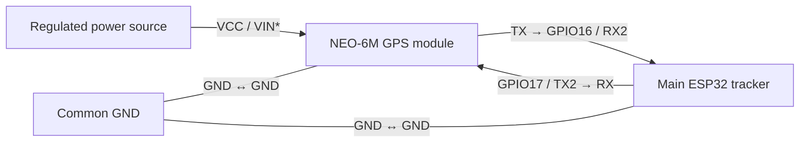
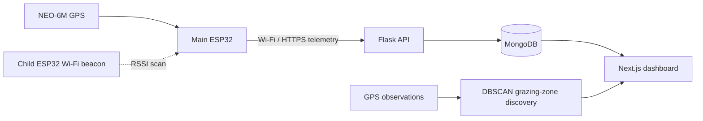

# CattleMO

CattleMO is an IoT livestock-monitoring system for tracking cattle location, analyzing grazing patterns, managing animal records, and understanding milk production through a web dashboard.

## Highlights

- Ingest live telemetry and GPS data from ESP devices.
- Track cattle location on an interactive map.
- Create and visualize grazing zones.
- Discover grazing zones automatically with DBSCAN clustering over GPS observations.
- Calculate cluster bounding boxes to show the geographic extent of discovered grazing areas.
- Manage animal profiles, including node association, details, and milk-yield history.
- Analyze morning, evening, and total milk production with per-animal and fleet-level charts.
- Review recent tracking logs and GPS connectivity information.

## Built with

- Next.js and TypeScript
- React and Tailwind CSS
- Flask and Python
- MongoDB
- ESP firmware
- Leaflet and React Leaflet
- Chart.js
- scikit-learn and DBSCAN clustering

## ESP32 hardware and wiring

CattleMO uses two ESP32 roles: a **main tracker** that collects GPS data and scans for nearby child nodes, and one or more **child beacon** boards that broadcast a Wi-Fi hotspot for proximity detection.

### Main tracker: ESP32 ↔ NEO-6M GPS

| NEO-6M GPS pin | Connect to | Purpose |
| --- | --- | --- |
| `TX` | ESP32 `GPIO16` (`RX2`) | GPS data sent to the ESP32 |
| `RX` | ESP32 `GPIO17` (`TX2`) | ESP32 serial data sent to the GPS |
| `GND` | ESP32 `GND` | Common ground — this connection is required |
| `VCC` | A supply allowed by the specific NEO-6M breakout board | GPS power |

\*Check the voltage label or datasheet of the GPS breakout before wiring power. Do not feed 5 V into an ESP32 `3V3` pin. The ESP32 board can be powered through USB or its appropriate `VIN`/`5V` input; the code does not assign any other GPIO pins to external hardware.

### Child beacon ESP32

The child sketch does not require a physical data connection to the main tracker. Each child ESP32 creates a Wi-Fi access point; the main tracker estimates proximity by scanning its signal strength (RSSI).

| Child-board connection | ESP32 pin | Notes |
| --- | --- | --- |
| Board power | USB or the board’s supported power input | Use a regulated supply appropriate for the ESP32 board. |
| Built-in status LED | `GPIO2` | Blinks to show the beacon is active; typically already wired on the development board. |
| Main-tracker link | Wi-Fi, no cable | The main tracker scans for the child hotspot. |

Before flashing, set the child’s `BEACON_NAME` and the main tracker’s `CHILD_SSID` to the same value. In the current sketches they differ (`CHILD_1` versus `Balu`), so the main tracker will not recognize the child beacon until they match.

## Data flow

## Project structure

- `frontend/` — Next.js dashboard for live tracking, maps, grazing zones, animal records, and analytics.
- `backend/` — Flask API, MongoDB data layer, telemetry ingestion, and DBSCAN-based GPS cluster analysis.
- `esp-codes/` — Device firmware for collecting and sending livestock telemetry.

## Project status

The repository contains deployment configuration for the backend, but no public application URL has been configured yet.

## License

No repository license has been selected yet. Please contact the repository owner before reusing the project outside the terms permitted by applicable copyright law.

## Contact

Created by [Kedar Pravin Damale](https://github.com/KedarDamale).
